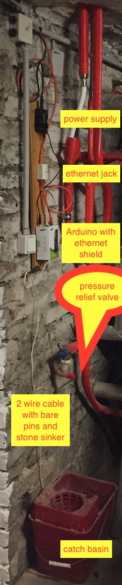
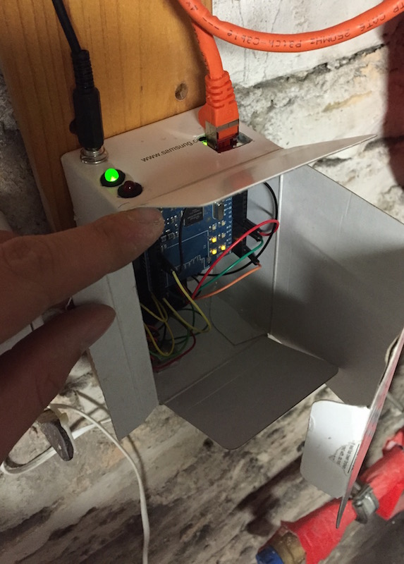
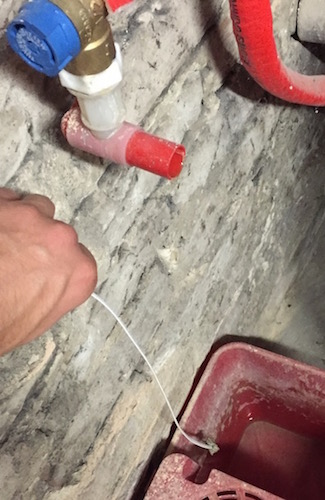

# Arduino based water sensor with webserver and pushover alarm notification

## Idea

If the sensor detects water (a very small current runs through the water) the arduino sends a message to pushover.
On HTTP requests the arduino's webserver responses with a json status message.

## Overall installation

### Inside the box

### "Sensor" 2 wire cable with stone sinker

